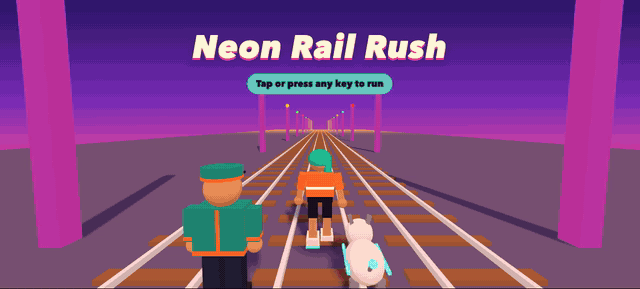
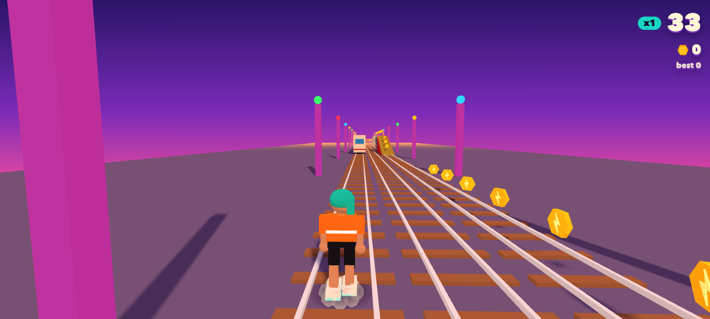
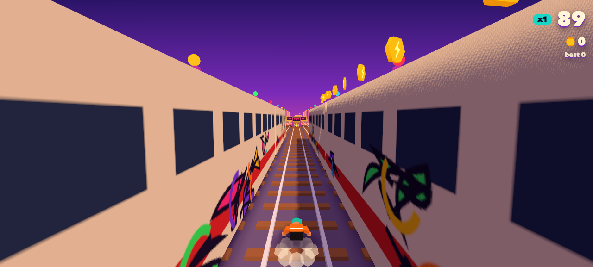

# Neon Rail Rush

A 3D, Subway Surfers-style endless runner for the browser, built by a coding agent with [Atomic](https://github.com/bastani-inc/atomic) while we talked about it on a livestream.



> **Built live on The Neuron.** This game was built in the background during the livestream [*Test and verification engineering for agentic coding*](https://www.youtube.com/live/AceHMOZJSeM?si=y31PD6Sy4DfGo_B4) with Alex Lavaee (Research Engineer, Microsoft Research's Catalyst Lab). The stream asks a practical question: when AI coding agents can build increasingly complex software on their own, how do you prove they actually did the job correctly? While the conversation covered testing, verification, and reliable agentic workflows, Atomic, an open-source verifiable coding agent runtime, worked on this game.

> **Not affiliated with Subway Surfers.** This is an unofficial fan project in the same genre. *Subway Surfers* is a trademark of SYBO Games. Neon Rail Rush uses only original characters (Nova the courier, Officer Brask the train inspector, and Volt his robo-hound), original art, and original code. No Subway Surfers assets, names, or likenesses are used.

## Status: work in progress

The run was stopped partway through, so this repository holds a playable but unfinished game.

| Part | State |
| --- | --- |
| Core run loop: three lanes, gravity-arc jump, roll, chase camera, 60 Hz fixed-step physics, developer panels | ✅ Verified and committed |
| Trains with ramps and walkable roofs, barriers, collisions, the inspector-and-dog chase, crash and catch, score and high score, speed ramp | ✅ Verified and committed |
| Coins, jetpack, super sneakers, coin magnet, score multiplier, snappy controls, sound effects, start screen | ✅ Verified and committed |
| Generated 3D models (concept art → Hunyuan3D → Blender) and the motion-captured run | 🚧 Generated locally, not yet committed; two asset review findings still open |
| Swapping the placeholder shapes for the real models | ⏳ Not started |
| Neon city, camera occlusion handling, 60 fps tuning | ⏳ Not started |

The playable build still uses simple placeholder shapes for characters and obstacles.

| Running the tracks | Between two trains |
| --- | --- |
|  |  |

The GIF and screenshots were captured from the committed build in Chrome (1280×577 page area), with the developer panels hidden (H). The run ends in a barrier crash, so the chasers catch Nova at the end.

## Play it

You need Node.js 20.19+ or 22.12+ (Vite's requirement).

```sh
npm install
npm run dev
```

Then open the URL Vite prints (usually http://localhost:5173).

| Action | Keyboard | Touch |
| --- | --- | --- |
| Start | any key | tap |
| Switch lanes | ← → or A D | swipe left / right |
| Jump | ↑, W, or Space | swipe up |
| Roll (also drops you fast from a jump) | ↓ or S | swipe down |
| Show or hide developer panels | H | |

## How it was built

Atomic ran this as one workflow, defined in [`.atomic/workflows/neon-rail-rush.ts`](.atomic/workflows/neon-rail-rush.ts). The project brief that every stage worked from is [`docs/brief.md`](docs/brief.md).

1. **Concept art.** Each character, prop, and the city skyline was drawn by OpenAI's `gpt-image-2.5-flare`, called through the Images API.
2. **3D models.** Each image became a textured 3D model through [Hunyuan3D-2.1](https://huggingface.co/spaces/tencent/Hunyuan3D-2.1) on Hugging Face.
3. **Cleanup and rigging.** Blender scripts in [`scripts/blender/`](scripts/blender/) scaled, grounded, and simplified the models and rendered previews. They also retargeted a motion-captured run from the [CMU Graphics Lab Motion Capture Database](http://mocap.cs.cmu.edu/) onto the runner.
4. **The game.** It was built in slices. Each slice had to pass its checks before it was shown or committed.

## How the agent's work was verified

Verification was the point of the livestream, so nothing reached the screen or the repository just because the agent said it was done.

- **Automated checks.** Every slice had to pass `npm run check`: TypeScript, unit tests (60 currently, covering things like the jump arc, collisions, the chase rules, and power-ups), a production build, and browser tests with Playwright.
- **Independent review.** A separate reviewer agent, in a fresh context, read the changes, played the game in a real browser, and took screenshots. It could reject the slice and send it back for repair.
- **Only verified builds were shown.** The live preview served only builds that had passed both. Failed work never reached it.
- **Asset gates.** Generated art and models went through their own review, with measured checks such as character heights, triangle counts, and whether the feet stay planted in the run cycle. That gate is what stopped the run: it caught broken skinning on the inspector and a roll animation tall enough to clip an overhead barrier.

Run the same checks yourself:

```sh
npx playwright install chromium   # first time only
npm run check
```

## Project layout

| Path | Contents |
| --- | --- |
| `src/sim/` | Game rules and physics, independent of rendering, with unit tests next to each file |
| `src/game/` | Three.js rendering, input, HUD, sound, developer panels |
| `e2e/` | Playwright browser tests |
| `scripts/blender/` | Model cleanup, rigging, and verification scripts |
| `docs/` | The brief, build log, and open asset review findings |
| `.atomic/workflows/` | The Atomic workflow that built the game |

## Links

- Livestream: https://www.youtube.com/live/AceHMOZJSeM?si=y31PD6Sy4DfGo_B4
- Atomic: https://github.com/bastani-inc/atomic
- The Neuron: https://www.theneurondaily.com/
